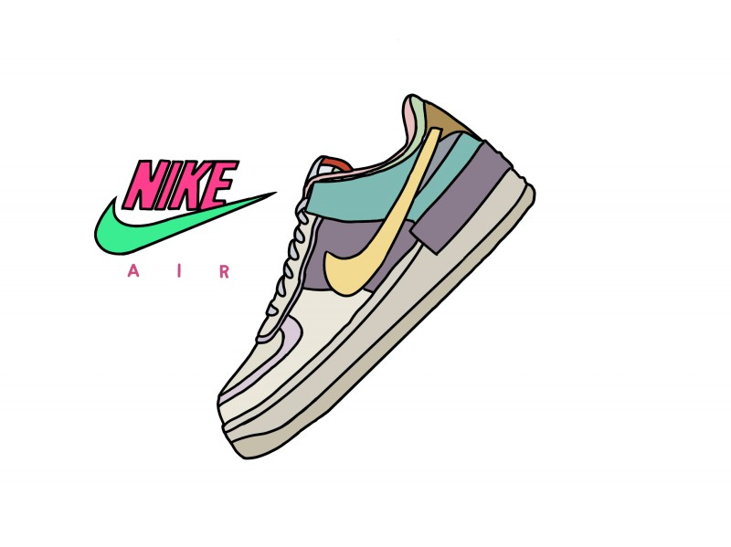
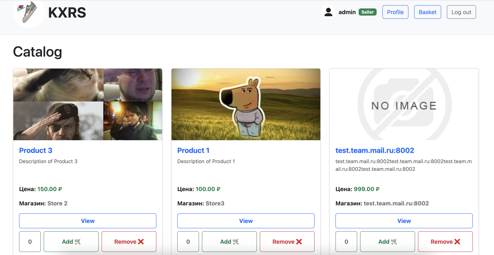
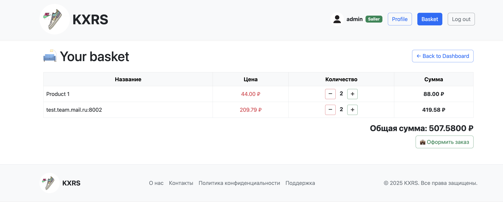
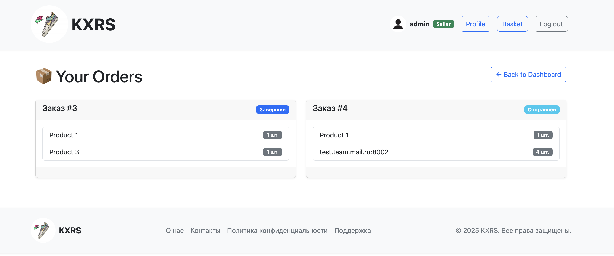

# Online Store Project




## E-commerce Platform Functionality Overview
Our platform allows users to register, browse products, and make purchases. Additionally, users can become sellers, create their own stores, and offer discounts on their products. The main features include:

### General User Features:
- Users can browse product listings but cannot add other users' products to their carts.
- The cart exists as a single instance per user and can only be recreated after completing an order.
- A dedicated cart page is available for users to view their selected products.
- Users can sort the product list for better navigation (upcoming feature).

### Seller Features:
- Users can convert their account into a seller account.
- Sellers can create their own store (limited to one store per user).
- Stores display the seller’s products, allowing customers to browse and purchase.
- Sellers can add new products to their store.
- Discounts can be applied to products, and these discounts will be visible in the user profile.

### Product & Store Management:
- Users can add and remove products from their cart (upcoming feature).
- Discounts created by sellers currently do not attach to products (to be fixed).
- Store pages will showcase the seller’s store and its products instead of listing all products separately.
- This functionality ensures a seamless shopping and selling experience while maintaining structured store management for sellers.

## Installation and Setup
0. Deploy virtual environment:
   ```bash
    python -m venv venv

1. Install dependencies:
   ```bash
    pip install -r req.txt

2. Set up the database in Docker:
   ```bash
   docker compose up -d

3. Load the database dump:
   ```bash
   python manage.py loaddata db_dump.json


4. Run the project:
   ```bash
   python manage.py runserver

## Models

### Users (`shop.user`)
- **Fields:**
  - `username`: User's username.
  - `password`: User's password.
  - `email`: User's email.
  - `is_sealer`: Flag indicating whether the user is a seller.
  - `phone`: User's phone number.
  - `photo`: User's photo.
  - `is_active`: User's active status flag.
  - `date_joined`: User's registration date.

### Stores (`shop.storename`)
- **Fields:**
  - `name`: Store name.
  - `is_active`: Store's active status flag.
  - `logo`: Store's logo.

### Seller Profiles (`shop.sellerprofile`)
- **Fields:**
  - `user`: Reference to the user (seller).
  - `store_name`: Reference to the store.
  - `description`: Store description.
  - `rating`: Store rating.
  - `created_at`: Profile creation date.
  - `updated_at`: Profile last update date.

### Products (`shop.product`)
- **Fields:**
  - `name`: Product name.
  - `description`: Product description.
  - `price`: Product price.
  - `owner`: Product owner (seller).
  - `photo`: Product photo.
  - `created_at`: Product creation date.
  - `updated_at`: Product last update date.
  - `category`: Product category.
  - `brand`: Product brand.
  - `quantity_in_stock`: Product stock quantity.
  - `is_active`: Product's active status flag.
  - `color`: Product color.
  - `material`: Product material.
  - `rating`: Product rating.
  - `discount`: Product discount.

### Discounts (`shop.discount`)
- **Fields:**
  - `name`: Discount name.
  - `description`: Discount description.
  - `discount_type`: Discount type (percentage or fixed).
  - `value`: Discount value.
  - `start_date`: Discount start date.
  - `end_date`: Discount end date.
  - `category`: Product category the discount applies to.
  - `product`: Product the discount applies to.

### Orders (`shop.order`)
- **Fields:**
  - `user`: User who placed the order.
  - `status`: Order status (e.g., "pending", "paid", "completed").
  - `delivery_date`: Order delivery date.
  - `created_at`: Order creation date.
  - `updated_at`: Order last update date.

### Order Items (`shop.orderitem`)
- **Fields:**
  - `order`: Order the item belongs to.
  - `product`: Product in the order.
  - `quantity`: Product quantity in the order.

### Baskets (`shop.basket`)
- **Fields:**
  - `user`: User the basket belongs to.


## Main menu view


## Basker


## Order List
